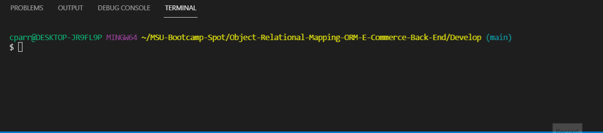
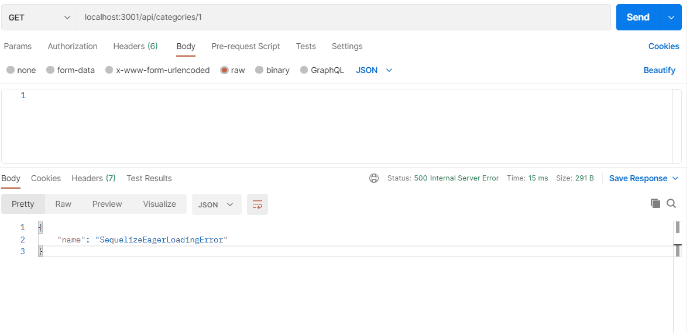

# Object-Relational-Mapping-ORM-E-Commerce-Back-End

Building an E-Commerce application back end by editing starter code then using a working Express.js API to use Sequelize and testing with Postman.

## User Story

```md
AS A manager at an internet retail company
I WANT a back end for my e-commerce website that uses the latest technologies
SO THAT my company can compete with other e-commerce companies
```
## How to run application

In the terminal run "npm i" to install all requirements, then "npm run seed" to fill in the table data, finally "npm start" to start the application.

The following animation shows installing, seeding, and starting the application in the terminal:



## How to test application

The following animation shows the application's GET routes to return all categories, all products, and all tags being tested in Postman:


The following animation shows the application's GET routes to return a single category, a single product, and a single tag being tested in Postman:



The following animation shows the application's POST, PUT, and DELETE routes for categories being tested in Postman:

